# Lab 2: Send Telemetry from an Azure Sphere to Azure IoT Central

<!-- 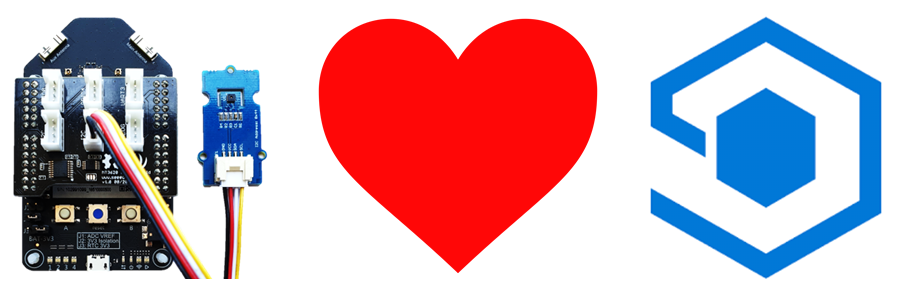 -->

---

|Author|[Dave Glover](https://developer.microsoft.com/en-us/advocates/dave-glover?WT.mc_id=github-blog-dglover), Microsoft Cloud Developer Advocate, [@dglover](https://twitter.com/dglover) |
|:----|:---|
|Date| March 2020|

---

## Azure Sphere Learning Path

Each module assumes you have completed the previous module.

[Home](https://github.com/gloveboxes/Azure-Sphere-Learning-Path/blob/master/README.md)

* Lab 0: [Introduction Azure Sphere and Lab Set Up](/zdocs/Lab_0_Introduction_and_Lab_Set_Up/README.md)
* Lab 1: [Build your first Azure Sphere Application with Visual Studio](/zdocs/Lab_1_Visual_Studio_and_Azure_Sphere/README.md)
* Lab 2: [Send Telemetry from an Azure Sphere to Azure IoT Central](/zdocs/Lab_2_Send_Telemetry_to_Azure_IoT_Central/README.md)
* Lab 3: [Control an Azure Sphere with Device Twins and Direct Methods](/zdocs/Lab_3_Control_Device_with_Device_Twins_and_Direct_Methods/README.md)
* Lab 4: [Integrating FreeRTOS with Azure Sphere Inter-Core Messaging](/zdocs/Lab_4_FreeRTOS_and_Inter-Core_Messaging/README.md)
* Lab 5: [Integrating FreeRTOS with Azure IoT Central](/zdocs/Lab_5_FreeRTOS_and_Azure_IoT_Central/README.md)
* Lab 6: [Over-the-air (OTA) Deployment](/zdocs/Lab_6_Over-the-air-deployment/README.md)

---

## What you will learn

You will learn how to build a High-Level [Azure Sphere](https://azure.microsoft.com/services/azure-sphere/?WT.mc_id=github-blog-dglover) application that connects and sends telemetry to [Azure IoT Central](https://azure.microsoft.com/services/iot-central/?WT.mc_id=github-blog-dglover).

---

## Prerequisites

The lab assumes you understand the content from [Lab 1: Secure, Build, Deploy and Debug your first Azure Sphere High-Level Application with Visual Studio](../Lab_1_Visual_Studio_and_Azure_Sphere/README.md)

---

## Introduction to the Learning Path Labs

There are a number of Learning Path libraries that support these labs. These Learning Path C functions are prefixed with **lp_**, typedefs and enums are prefixed with **LP_**. 

The Learning Path libraries are open source and contributions are welcome.

The Learning Path libraries are built from the [Azure Sphere Samples](https://github.com/Azure/azure-sphere-samples) and aim to demonstrate best practices.

The Learning Path libraries are **not** part of the official Azure Sphere libraries or samples.

---

## Supported browsers for Azure IoT Central

We recommend that you use the most up-to-date browser that's compatible with your operating system. The following browsers are supported:

* Microsoft Edge (latest version). This means the **Chromium** version of the Microsoft Edge Browser
* Safari (latest version, Mac only)
* Chrome (latest version)
* Firefox (latest version)

[Supported browsers for Azure IoT Central](https://docs.microsoft.com/en-us/azure/iot-central/core/iot-central-supported-browsers)

## Tutorial Overview

1. How to create an Azure IoT Central Application from a template.

2. Enabling trust between your Azure Sphere Tenant and your Azure IoT Central Application for automatic device enrollment.

3. Whitelisting the Azure IoT Central Application URL endpoint.

4. Configuring the Azure Sphere Application to connect to Azure IoT Central.

---

## Key Concepts

### Azure IoT

Your Azure Sphere device can securely connect and communicate with cloud services. Azure Sphere includes built-in library support for both Azure IoT Hub and Azure IoT Central. This lab focuses on Azure IoT Hub.

---

## SETTING UP IOT HUB AND DEVICE PROVISIONING

**SETTING UP IOT HUB AND DEVICE PROVISIONING**

[Set up an Azure IoT Hub for Azure Sphere](https://docs.microsoft.com/en-us/azure-sphere/app-development/setup-iot-hub)
---

## Step 4: Whitelist the Azure IoT Hub and Device Provisioning Endpoints

Remember, applications on Azure Sphere are locked down by default, including hardware and network endpoints. You must whitelist the network endpoints of your Azure IoT Hub and Device Provisioning Service otherwise your Azure Sphere Application will not be able to connect to it.

### Step 5: Get the Azure Sphere Tenant ID

We need the ID of the Azure Sphere Tenant that is now trusted by Azure Device Provisioning Service.

1. From the **Azure Sphere Developer Command Prompt**, run **```azsphere tenant show-selected```**.
    * The output of this command will look similar to the following.
        ```text
        Default Azure Sphere tenant ID is 'yourSphereTenant' (99999999-e021-43ce-9999-fa9999499994).
        ```
    * The **Tenant ID** is the numeric value inside the parentheses.
2. **Copy the Tenant ID to _Notepad_** as you will need it soon.

---


### Step 2: Generating Azure IoT Hub Events

Review the handler function **ButtonPressCheckHandler** below. The following code sends the Button Pressed events to Azure IoT Hub.

```c
// Send ButtonA Pressed Event
if (snprintf(msgBuffer, JSON_MESSAGE_BYTES, cstrJsonEvent, cstrEvtButtonA) > 0) {
	SendMsgLed2On(msgBuffer);
}
```

The Azure Sphere will send the following JSON formatted event messages to IoT Central depending on which button is pressed.

* { "ButtonA": "occurred" }
* { "ButtonB": "occurred" }

---

## Open Lab 2

### Step 1: Start Visual Studio 2019

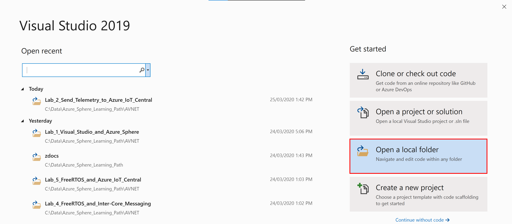

### Step 2: Open the lab project

1. Click **Open a local folder**.
2. Open the Azure-Sphere lab folder.
4. Open the **Lab_2_Send_Telemetry_to_Azure_IoT_Central** folder.
5. Click **Select Folder** button to open the project.

### Step 3: Set your developer board configuration

These labs support developer boards from AVNET and Seeed Studio. You need to set the configuration that matches your developer board.

The default developer board configuration is for the AVENT Azure Sphere Start Kit. If you have this board, there is no additional configuration required.

1. Open CMakeList.txt
2. Add a # at the beginning of the set AVNET line to disable it.
3. Uncomment the **set** command that corresponds to your Azure Sphere developer board.
4. Save the file. This will auto-generate the CMake cache.

    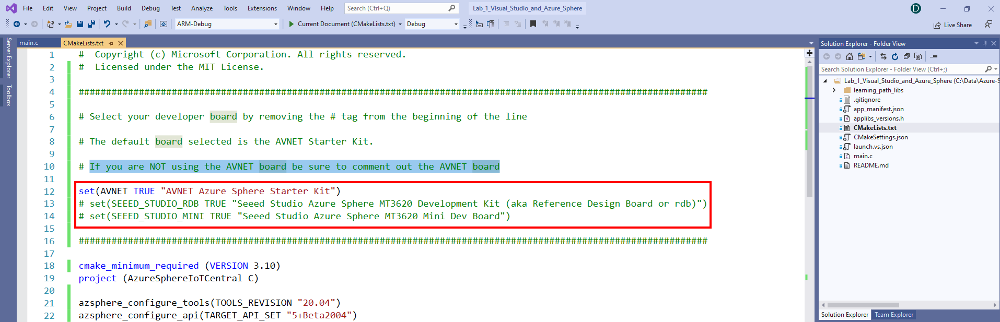

### Step 4: Configure the Azure Sphere Application

1. Open the **app_manifest.json** file

    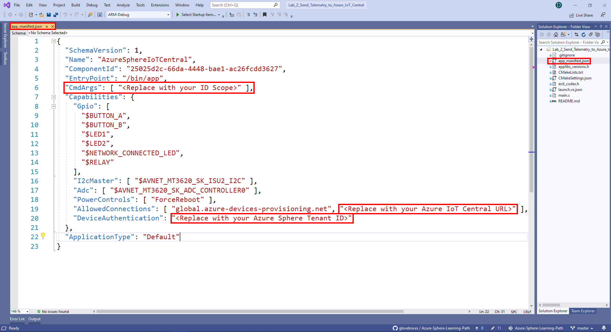

2. Update the Azure IoT Central Application connection properties.
    * Update **CmdArgs** with your Azure IoT Central **ID Scope**.
    * Update **DeviceAuthentication** with your **Azure Sphere Tenant ID**. Remember, this was the numeric value output from the ```azsphere tenant show-selected``` command that you copied to Notepad.

3. Update the network endpoint whitelist with your Azure IoT Central Application URL.
    * Update **AllowedConnections** with your **Azure IoT Central Application URL**.

4. **Review** your updated manifest_app.json file. It should look similar to the following.

    ```json
    {
        "SchemaVersion": 1,
        "Name": "AzureSphereIoTCentral",
        "ComponentId": "25025d2c-66da-4448-bae1-ac26fcdd3627",
        "EntryPoint": "/bin/app",
        "CmdArgs": [ "0ne0099999D" ],
        "Capabilities": {
            "Gpio": [
            "$BUTTON_A",
            "$BUTTON_B",
            "$LED1",
            "$LED2",
            "$NETWORK_CONNECTED_LED",
            "$RELAY"
            ],
            "I2cMaster": [ "$AVNET_MT3620_SK_ISU2_I2C" ],
            "PowerControls": [ "ForceReboot" ],
            "AllowedConnections": [ "global.azure-devices-provisioning.net", "saas-iothub-99999999-f33a-9999-a44a-7c99999900b6.azure-devices.net" ],
            "DeviceAuthentication": "9d7e79eb-9999-43ce-9999-fa8888888894"
        },
        "ApplicationType": "Default"
    }
    ```

4. **IMPORTANT**. Copy the contents of your **app_manifest.json** file to **notepad** as you will need this configuration information for the next labs.

---

## Build, Deploy and Debug the Azure Sphere Application

### Sending telemetry to Azure IoT Hub

Open **main.c**, and scroll down to the **MeasureSensorHandler** function.

>Pro Tip. Use the **Function Navigator** dropdown for quick code navigation. Click on the dropdown list, then select and click the function name. You will often see a function name listed twice in the dropdown. The first is the function forward signature, and the second is the implementation of the function.

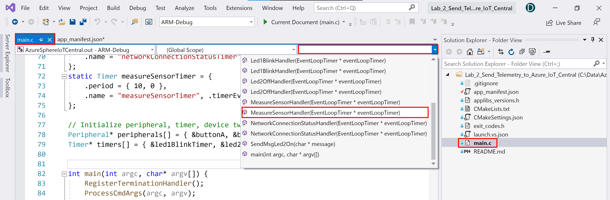

In the **MeasureSensorHandler** function there is a call to **SendMsgLed2On(msgBuffer);**.

```c
/// <summary>
/// Read sensor and send to Azure IoT
/// </summary>
static void MeasureSensorHandler(EventLoopTimer* eventLoopTimer)
{
	if (ConsumeEventLoopTimerEvent(eventLoopTimer) != 0)
	{
		lp_terminate(ExitCode_ConsumeEventLoopTimeEvent);
		return;
	}
	if (lp_readTelemetry(msgBuffer, JSON_MESSAGE_BYTES) > 0)
	{
		SendMsgLed2On(msgBuffer);
	}
}
```

Function **SendMsgLed2On** will turn on LED2, then **SendMsg(message)** is called to send a JSON formatted message to Azure IoT Central.

```c
/// <summary>
/// Turn on LED2, send message to Azure IoT and set a one shot timer to turn LED2 off
/// </summary>
static void SendMsgLed2On(char* message)
{
	lp_gpioOn(&led2);
	Log_Debug("%s\n", message);
	lp_sendMsg(message);
	lp_setOneShotTimer(&led2BlinkOffOneShotTimer, &led2BlinkPeriod);
}
```

### Step 1: Set the build configuration

Before building the application with Visual Studio, ensure the ARM-Debug and GDB Debugger (HLCore) options are selected.

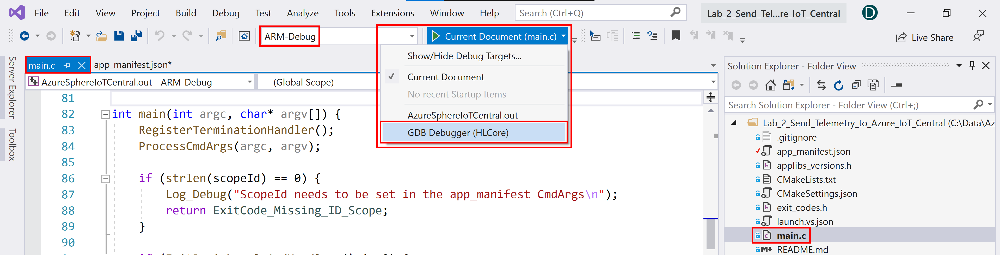

### Step 2: Start the Azure Sphere Application

To start the build, deploy, debug process, either click the Visual Studio **Start Selected Item** icon, or press **<kbd>F5</kbd>**, or from the Visual Studio main menu, click **Debug**, then **Start**.

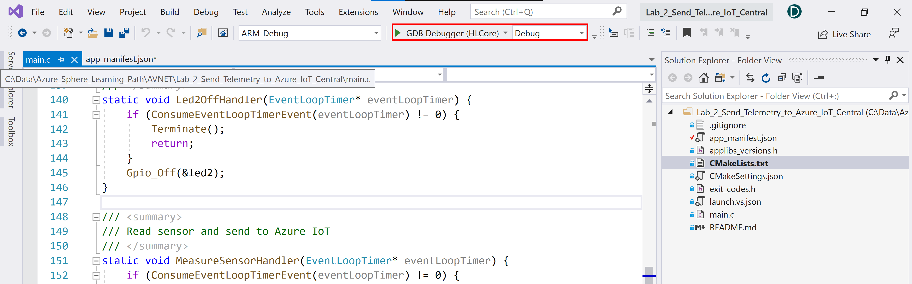

### Step 3: View debugger output

Open the **Output** window to view the output from **Log_Debug** statements in the code. You will see the device negotiating security, and then it will start sending telemetry to Azure IoT Central.

You can open the output window by using the Visual Studio <kbd>Ctrl+Alt+O</kbd> shortcut or click the **Output** tab found along the bottom/right of Visual Studio.

#### Notes

1. Ensure **Device Output** is selected from the **Show output from** dropdown list.
2. You may see a couple of *ERROR: failure to create IoTHub Handle* messages displayed. These message occur while the connection to IoT Central is being established.

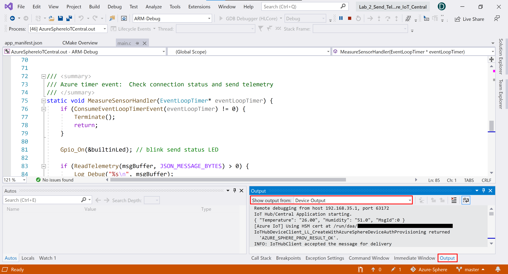

---

## Expected Device Behaviour

### Avnet Azure Sphere MT3620 Starter Kit

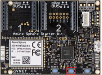

1. The blue LED will start to blink.
2. LED3 will turn yellow when connected to Azure. 
3. Press **Button A** on the device to change the blink rate.

### Seeed Studio Azure Sphere MT3620 Development Kit

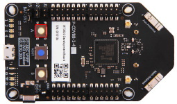

1. The green LED will start to blink.
2. The network LED will turn red when connected to Azure.
3. Press **Button A** on the device to change the blink rate.

### Seeed Studio MT3620 Mini Dev Board

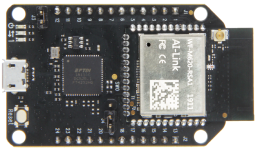

1. The green LED closest to the USB connector will start to blink.
2. Given there are no builtin buttons, virtual **Button A** and **Button B** presses will be generated every 5 seconds.
3. The virtual button presses will change the blink rate.

---

## Step 3: View the device telemetry on the Azure IoT Central Dashboard

1. Switch back to Azure IoT Central in your web browser.
2. You need to wait a minute or two before your Azure Sphere device is automatically enrolled.
3. The newly enrolled device will have a numeric name that matches your Azure Sphere Device ID.
4. To display your Azure Sphere Device ID, start the **Azure Sphere Developer Command Prompt** and run the following command.

    ```bash
    azsphere device show-attached
    ```

---

## Display device telemetry from the Azure Portal Shell

TODO: Explanation

```bash
az iot hub --monitor-events --hub-name <your iot hub name>
```

---

## In Review

We learned the following:

1. How to create an Azure IoT Central Application from a template.

2. Enabling trust between your Azure Sphere Tenant and your Azure IoT Central Application for automatic device enrollment.

3. Whitelisting the Azure IoT Central Application URL endpoint.

4. Configuring the Azure Sphere Application to connect to Azure IoT Central.

---

## Close Visual Studio

Now close **Close Visual Studio**.

---

## Finished 完了 fertig finito समाप्त terminado

Congratulations you have finished Lab 2.


---

**[NEXT](../Lab_3_Control_Device_with_Device_Twins_and_Direct_Methods/README.md)**

---
