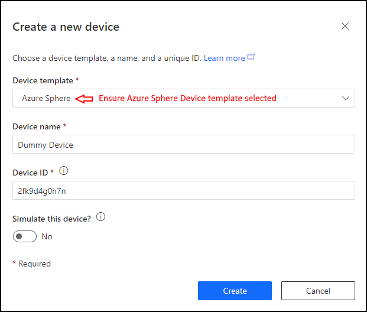

From the **Azure Sphere Developer Command Prompt**, type the following command.

```bash
azsphere device show-attached
```

Note: The Create New Device dialog box in Azure IoT Central requires that the device ID be in lowercase characters. From the Azure Sphere Developer Command Prompt, enter the following command, which gets the ID of the attached device and converts it to lowercase:

```bash
powershell -Command ((azsphere device show-attached)[0] -split ': ')[1].ToLower()
```

#### Switch back to Azure IoT Central Web Portal

1. Select Devices from the side menu, then the Device Template previously created.

2. Click **+ New** to add a new device

    Paste in the **device ID** you generated with the PowerShell command into the **Device ID** field and give your device a friendly name.


3. Click **Create** to create the new device.

---

## Preparing the High-Level Azure Sphere Application

### Understanding the High-Level Core Security

Applications on Azure Sphere are locked down by default and you must grant capabilities to the application.

High-Level Application capabilities include what hardware can be accessed, what internet services can be called (including Azure IoT Central and the Azure Device Provisioning Service), and what inter-core communications are allowed.

The following is an example of an **app_manifest.json** capabilities definition.

```json
{
  "SchemaVersion": 1,
  "Name": "AzureSphereIoTCentral",
  "ComponentId": "25025d2c-66da-4448-bae1-ac26fcdd3627",
  "EntryPoint": "/bin/app",
  "CmdArgs": [ "Fake", "0ne0999999D", "6583cf17-d321-4d72-8283-0b7c5b56442b" ],
  "Capabilities": {
    "Gpio": [ 0, 19, 21 ]
    "Uart": [ "ISU0" ],
    "AllowedConnections": [ "global.azure-devices-provisioning.net", "saas-iothub-99999999-f33a-4002-a44a-9999991b00b6.azure-devices.net" ],
    "DeviceAuthentication": "99999999-e021-43ce-9f2b-999999997494"
  },
  "ApplicationType": "Default"
}
```

**Review the Capabilities section**:

1. **Gpio**: This application uses three GPIO pins. Pins 0 (a relay switch), 19 (blink send status), and 21 (device twin test LED).
2. **Uart**: The Uart is used to communicate with the Seeed Studio Grove Shield.
3. **AllowedConnections**: What internet URLs can be called.
4. **DeviceAuthentication**: Your Azure Sphere Tenant ID.
5. **AllowedApplicationConnections**: This is the Component ID of the Real-Time application this application will be partnered with. It is required for inter-core communications.
6. **CmdArgs**: The command line argument passed to the application at startup is the Azure IoT Central Scope ID.

---

## Azure IoT Central Configuration

To connect a device to Azure IoT Hub or IoT Central a Device Connection string is required. For **security** and **manageability** do **NOT** hard code the Azure IoT connection string in your High-Level application.

When you created the device in Azure IoT Central you used the **immutable (unforgeable)** Azure Sphere Device ID that was burnt into the device when it was manufactured.

This Device ID along with the following information:

1. The Azure IoT Central Scope ID,
2. The Global URL for the Azure Device Provisioning Service,
3. The URL of your Azure IoT Central Application,
4. Your Azure Sphere Tenant ID

are passed to the Azure Device Provisioning Service from your Azure High-Level application to obtain the Azure IoT Connection string.

### Step 1: Start Visual Studio 2019


### Step 2: Open the lab project

1. Click **Open a local folder**
2. Navigate to the folder you cloned **Azure Sphere Learning Path** into.
3. Double click to open the **Lab_2_Send_Telemetry_to_Azure_IoT_Central** folder
4. Click **Select Folder** button to open the project

    <!--  -->

### Step 3: Azure IoT Central Connection Information

1. Open the **app_manifest.json** file
    

1. Set the **default Azure Sphere Tenant**

    You may need to select the default Azure Sphere Tenant.

    Press <kbd>Windows Key</kbd>, type **Azure Sphere**. Select and start the **Azure Sphere Developer Command Prompt**.
    <br/>
    
    Run the following commands:
    * List available tenants ```azsphere tenant list``` 
    * Set the default tenant ```azsphere tenant select -i <guid>```
    <br/>
2. Get the **Tenant ID**.

    From the **Azure Sphere Developer Command Prompt**, run the following command.

    ```bash
    azsphere tenant show-selected
    ```

    Copy the returned value and paste it into the **DeviceAuthentication** field of the **app_manifest.json**.
    <br/>
3. Get the **Device Provisioning Service URLs**

    From the **Azure Sphere Developer Command Prompt**, navigate to the folder you cloned Azure Sphere Learning Path. Change to the *tools* folder and run the *ShowIoTCentralConfig.exe* command.

    ```bash
    ShowIoTCentralConfig
    ```

    When prompted, log in with the credentials you use for Azure IoT Central. The output of this command will be similar to the following:

    ```text
    Are you using a Work/School account to sign in to your IoT Central Application (Y/N) ?

    Getting your IoT Central applications
    You have one IoT Central application 'yourappname-iot-central'.
    Getting the Device Provisioning Service (DPS) information.
    Getting a list of IoT Central devices.

    Find and modify the following lines in your app_manifest.json:
    "CmdArgs": [ "0ne9992KK6D" ],
    "AllowedConnections": [ "global.azure-devices-provisioning.net", "saas-iothub-9999999-f33a-4002-4444-7ca8989898989.azure-devices.net" ],
    "DeviceAuthentication": "--- YOUR AZURE SPHERE TENANT ID--- ",
    ```
    <br/>
 4.   Find and modify the **CmdArgs**, **AllowedConnections**, and the **DeviceAuthentication** properties in the app_manifest.json with the information returned from the ```ShowIoTCentralConfig``` command.

 Your **manifest_app.json** file will look similar to the following when you are done.

```json
{
    "SchemaVersion": 1,
    "Name": "AzureSphereIoTCentral",
    "ComponentId": "25025d2c-66da-4448-bae1-ac26fcdd3627",
    "EntryPoint": "/bin/app",
    "CmdArgs": [ "Fake", "0ne0099999D" ],
    "Capabilities": {
        "Gpio": [ 0, 19, 21 ]
        "Uart": [ "ISU0" ],
        "AllowedConnections": [ "global.azure-devices-provisioning.net", "saas-iothub-99999999-f33a-9999-a44a-7c99999900b6.azure-devices.net" ],
        "DeviceAuthentication": "9d7e79eb-9999-43ce-9999-fa8888888894"
    },
    "ApplicationType": "Default"
}
```

**[Next Step: Configure Visual Studio App Deployment Settings](README.md#configure-visual-studio-app-deployment-settings)**
