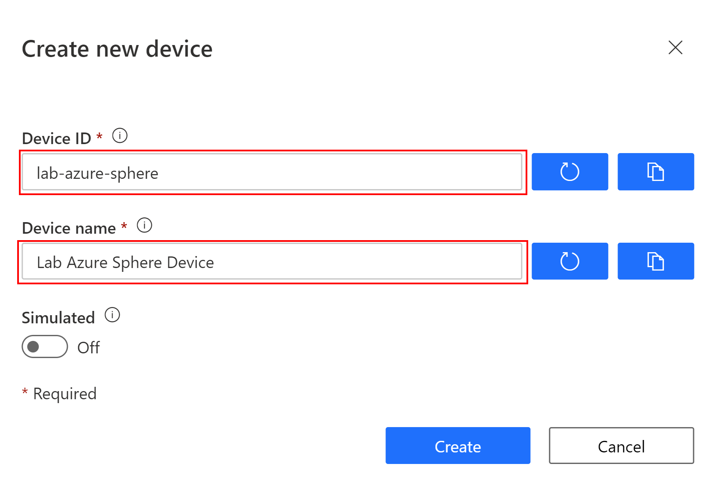
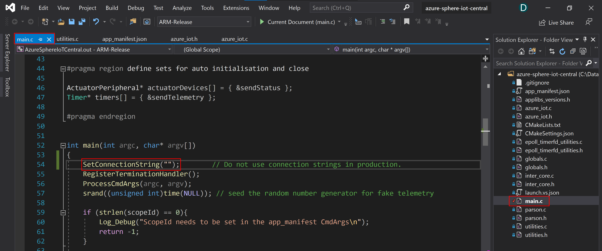

# Connecting a shared Lab Azure Sphere Device

If you are using an Azure Sphere in a lab environment and do not have access to the Azure Sphere tenant the Azure Sphere was claimed into then you need to use a Azure IoT Connection.

The connection string is hard coded in to the application and is there not suitable for product deployments.

---

## Step 1: Switch back to Azure IoT Central Web Portal

1. Select Devices from the side menu, then the **Azure Sphere** Device Template.
    

2. Click **+ New** to add a new device
3. Set friendly names for the **Device ID** and the **Device name** fields.

    

4. Click **Create** to create the new device.

---

## Step 2: Create an Azure IoT Connection String

1. Open the newly created device by clicking on the device name.

    

2. Open the Device Connection information panel by clicking on the **Connect** button.

    

3. The device connection configuration will be displayed.

    

4. **Right mouse click** and open the [Azure IoT Central Connection String Generator](https://dpsgen.z8.web.core.windows.net/) in a **new browser tab**.

5. Copy and paste the **Device Connection** information (Scope Id, Device ID, and Primary Key) from Azure IoT Central to the **Azure IoT Central Connection String Generator**.

6. Click **Get Connection String**

    

7. Mark and copy the connection string as you will need to paste into the Visual Studio Azure Sphere project.

---

## Step 3: Start Visual Studio 2019


---

## Step 4: Open the lab project

1. Click **Open a local folder**
2. Navigate to the folder you cloned **Azure Sphere Learning Path** into.
3. Double click to open the **Lab 2 - Send Telemetry from an Azure Sphere to Azure IoT Central** folder
4. Double click to open the **azure-sphere-iot-central** folder
5. Click **Select Folder** button to open the project

    <!--  -->

---

## Step 3: Add the Connection String to the App

1. Open the main.c file.

    

2. Locate call to **SetConnectionString** and paste the connection string you generated between the quote marks.

    *Your code should the same as the following, but with your connection string.*

    ```c
    int main(int argc, char* argv[])
    {
        SetConnectionString("HostName=iotc-0999990bc-3305-4cba-999e-9999fc4cf701.azure-devices.net;DeviceId=lab-azure-sphere;SharedAccessKey=m9a4ipjlkz3WmUJrkzRBy/4Zpq52mtahZUJB6j2d5lk=");		// Do not use connection strings in production.
        RegisterTerminationHandler();
        ProcessCmdArgs(argc, argv);
    ```

**[Next Step: Configure Visual Studio App Deployment Settings](README.md#configure-visual-studio-app-deployment-settings)**
